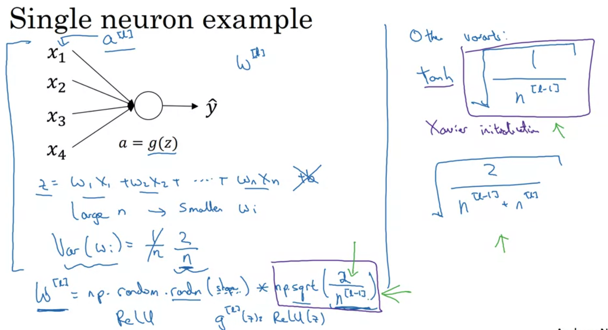
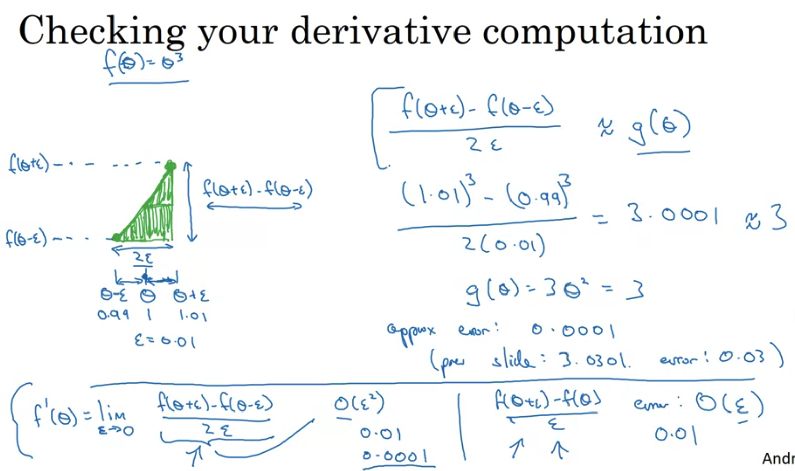
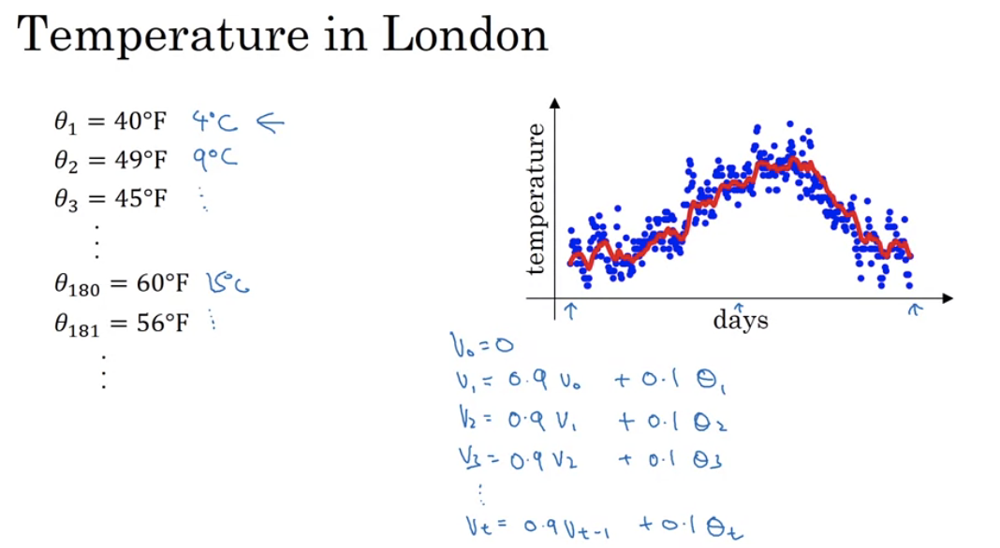
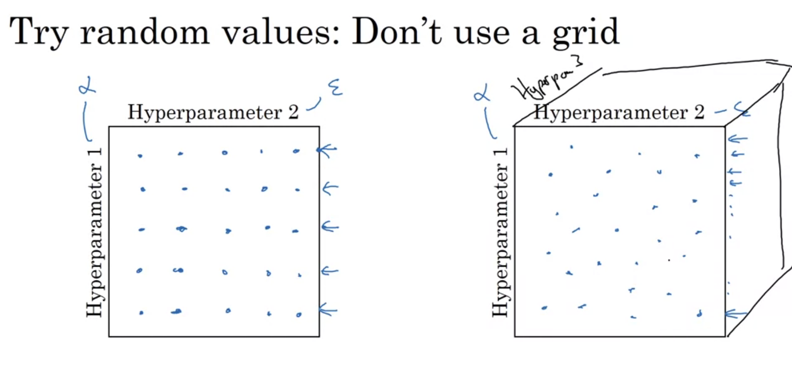

# Course 2: Improving Deep Neural Networks: Hyperparameter Tuning, Regularization and Optimization

## Week 1

## Setting up your Maschine Learning Application

### Train/dev/test

#### Applied ML is highly iterative process  

- layers
- hidden units
- leraning rates
- activation functions

Idea -> Code -> Experiment -> Idea...

#### Train/dev/test sets

- Previous era 70/20/10 splitting
- Modern era, million of examples 98/1/1 is more reasonable

#### Mismatched train/test distribution

Training set: Cat form webpages
Dev/test set: Cat pictures from users

-> Make sure that trian/test come from the same distribution

### Bias / Variance

train/dev error: %1/%11 -> high variance
trian/dev error: 15%/16% -> high bias (humen level is around %0-1 error)
trian/dev error: 15%/30% -> high bias and high variance
  
train/dev error: 0.5%/1% -> low/low

All under the assumption that base error is quit small and same distribution of train/dev

### Basic Recipe for ML

#### High bias?

Try:

- bigger network
- Train longer
- Different archs

#### High Variance?

Try:

- More data
- Regularization
- Different archs

In the past it was a tradeoff, in the modern big dat era you can deal both without hוrting the other.

## Regularization your NN

### Regularization

- L2 is the most common regularization
- Useually doesn't regulate bias which is low dim
- L1 regularization cause the sparse w (many zeros) can be used to compress model
- lambda = regularization paramater

- backprop changed with extra regularization term
- L2 called "Weight Decay", see bottom of slide to understand why

### Why regularization reduces overfitting?

- Intuition: many parameters close to zero with no impact and cause to simpler network

- tanh activation: small values of W cause linear output and prevent overfitting
- Tip: when ploting J over iteration for debug don't forget the regularization term (else might not see monotonically decrease)

### Dropout regularization

- drop several nodes connection on each forward stage
- less nodes active on each such iteration and because of that eliminate overfitting

#### Inverted dropout

#### Making prediction at test time

- No dropout (will cause noise)
- do not divide by keep_prob on test (only train), else will get increased weight

### Why does drop-out work?

- Intuition: single unit can't rely on any one feature, so have to spread out weights -> shrinking weights
- it is possible to provide different keep_prob per layer (bigger layers needs smaller keep_prob value)
- to input layer recommended to be with keep_prob = 1 or very high value such 0.9

### Other regularization method

#### Data augmentation

for example flip, crop, rotate, zooming image train inputs

#### Earrly stopping

- plots dev/train set error over iterations.
- find iteration that the erros starts to move away from each other and train again up to that point.
- Andrew doesn't recommend because you also stop J to arrive its optimal value

## Setting up your optimization problem

### Normalizing inputs

#### Steps

- Subtruct the mean
- Normalize the variance

#### Why normalize inputs?

### Vanishing / Exploding gradients

Deep networks activation might explodes/vanished because of exponential increase/decrease

### Weight initialization for DNN

- fixing initalization to consider fan in and normalize the sum of weights to gaussion with mean 0 and variance 1 reduce the problem
- nomarator 2 proposed for Reuly, for tanh it is better to use nomarator 1 (Xavier)

### Numerical approximation of gradients

When implementing back propagation it usefull to make sure gradients calculation implemented correctly by comparing to numerical calculated gradients

### Gradient checking

- take all parameters and reshape to one vector teta
- take all direvativs and reshape to one vector dteta
- for each index of the vector:
    dteta_approx[i] = J(teta_1...teta_i-1,teta_i+epsilon, teta_i+1..) - J(teta_1...teta_i-1,teta_i-epsilon, teta_i+1..) 
- check  (|dteat_approx - dteta|) / (|dteta| + dtetat_approx|) < maximum_epsolin

### Gradient checking implementation notes

- Don't use in training - only for debug (very slow)
- If grad check fail, look at specific components to try to identify bug.
- Don't forget the regulartization term
- Doesn't work with dropout, at least not straight forward. can turn off and check other logic and then turn on (without validate dropout)
- There are cases that implementation is correct only for small parameters w_1b around zero, and doesn't work for big numebrs, so run the grad checks also after few iterations (when few parameters will be larger)

## Week 2

## Optimization algorithms

### Mini-batch vs. gradient descent

- regular implementation of gradient descent that calculate step after going over all M samples is very slow on big data. 
- Split the data to mini-batches and update parameters after each mini-batch processing

- Still user vectorized implementation on each mini-batch
- replace m on the formula to the batch size
- "1 epoch" - pass through whole training set

### Understanding mini-batch gradient descent

- Cost may not decrease on each iteration because it train on different samples batch each time

- if mini-batch size = m -> same as regular gradient descent. very smooth with low noise and large steps. Too long per iteration
- if minibatch size = 1 -> stochastic gradient descent (SGD). extremly noisy and sometime goes in the wrong direction. will never converge to final point. loose vectorization
- few thousands mini-batch size provides advantage of both extermes

#### Choosing your mini-batch size

- Use batch gradient descent for small training set (few thousands)
- Typical mini-batch size: 64, 128, 256, 512... (try to use power of 2)
- Make sure minibatch fits in cpu/gpu memory

### Exponentially weighted averages

### Understanding exponentially weighted averages

- After 1/epsilon days  coeff ~= 1/e, roughly how many days actually affect the average
- useually just save the last value V_theta and update it every day

### Bias correction in exponentially weighted averages

- needs to correct the initial phase values which doesn't have enough history. cause coeffecients to sum up to 1.

### Gradient descent with momentum

- Wants to eliminate oscilations that that slow convergence  
- The idea is to compute exponentially weighted average of the mini-batches derivatives and use it instead the mini-batch derivatives to update parameters.
- Vertical direction averge will be close to zero. Horizontal direction average will increase.
- Nice analaog to acceleration and velocity of ball rolling down a bowl.

- How do you calculate Vdw, Vdb?
- What hyperparameters do you have?
- Bias correction: in practice doesn't do it because after 10 iteration (for beta=0.9) there is no longer bias.
- sometimes using formulation without (1-beta) which is less intuitive. beta affect scaling of the new direvatives as well.

### RMSprop

- What is the intuition to direvatives divide with the exponential weights averages of elementwise squre root direvatives? reduce oscilations on the vertical direction
- as results, can increase alpha
- Why do we add small value epsilon to the denominator? to ensure numerical stability and eliminate divide by ~zero.

### Adam optimization algorithm

- (slides missing square of db on the rmsprop expression)
- What two other methods combined in Adam optimization? momentum and rmsprop
- In typical Adam implementaion we do perform bias correction

- What hyperparameters do we have ? alpha, beta_1, beta_2, epsilon

- In practice most of the times try range of alpha and doesn't change the others 
- what hyperparameters recommended by the paper: beta_1=0.9, beta_2=0.999, epsilon=10E-8
- Where Adam come from: Adaptive moment estimation

### Learning rate decay

- What is the intuition? when you far away from the minima you want large steps, but when approaching the minima you want to reduce step size in order to prevent oscilaton around it.

- what hyper parameters do we have?decay_rate and alpha_zero
- slides alpha numbers are wrong (0.67 instead 0.067 etc.)

#### Other learning rate decay methods

### The problem of local optima

- Most points of zero gradient on high dimensional space are saddle points and not local optima.
- A lot of the intuition about lower dimension spaces don't transfer to higher dimension spaces.
- So local optima are not really problam. what is the proble? plateaus. 

to summerize:

- unlikely to get stuck in a bad local optima
- plateaus can make learning slow

## Week 3

## Hyperparameter tuning

### Tuning process

- DNN requires many hyper parameter tuning
- which are the most important? (according andrew)
  1. learning rate
  2. momentom beta, hidden units, mini-batch size 
  3. number of layers, learning rate decay
- Andrew almost never tune adam betas and epsilon

- Why to use random search and not to use grid search? don't waste compute power/time on hyperparameters that almost doesn't affect (for example epsilon).

- In coarse to fine you zoom in to limited region after finding that this area provides better results

### Using an appropriate scale to pick hyperparameters

- Uniform sampling for hyper parameter tuning are not always reasonable
- learning_rate: better to sample uniformaly from the log scale.
- beta: sampling unirformlt from log-scale of for (1-beta)

### Hyperparameters tuing in practice: Pandas vs. Caviar

- Babysitting one model: running one model, suite for limited resource environment. train -> evaluate -> train again after changing few parameters and again... maybe change the model itself and run again etc.
- Training many models in parallel: needs enough computers.

## Batch Normalization

### Normalizing activations in a network

- In the same manner that we normalize NN inputs in order to make optimization faster, we would like to normlize intermidiate results between layers
- There is a debate on the litrature if you should normalize before or after activation. In practice pre activation is done more often.

- Why do we adding epsilon to the norm calculation? stability in case of variance zero
- We don't want always normal(0,1) hence adding to parameters gamma, beta (not hyperparameter)
- What values of gamma and beta will cancel normazliation?

### Fitting Batch Norm into a NN

- beta and gamma vector parameters added to each layer
- can update the batch parameters in the same way we optimze the NN parameters

- In practice, working with mini-batches
- Each mini-batch used only its batch data statistics 
- We no longer needs the bias parameter b, becuase we cancel it on the normalization process and then add the normalization batch beta as bias
- the dimension of beta gamma for each layer is (#cells at layer, 1)

### Why does Batch Norm work?

- Makes features on deeper layers more robust to changes on previous layers

- batch norm ansure that the mean and variance of ineer layers output will stay the same even if the input distribution changed, decouplung layers dependency on previous layers shifts

- large mini-batches reduce the regularization effect (less noisy beta, gamma between mini-batches)
- Don't try to use it for regularization effect (altough it do have this unintended affect)

### Batch Norm at test time

- At test time might need to process the examples one at a time
- Useually use exponential weighted average across mini-batches to estiamate testtime beta and gamma parameters
- Why not preserve online average too? (question of mine)

## Multi-class classification

### Softmax regression

### Training a softmax classifier

- [softmax derivatives is: y_hat - y](https://math.stackexchange.com/questions/945871/derivative-of-softmax-loss-function)

## Intoduction to programing frameworks

