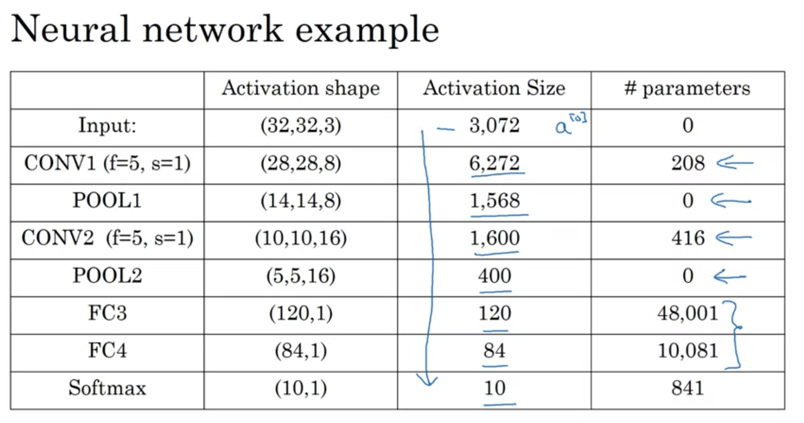

# Course 4: Convolutional Neural Networks

## Week 1

## Convolutional Neural Networks

### Computer Vision

can you use FF network with large image inputs? No, it will cause hugh number of parameters if using regular FF networks.
For example, 1000x1000 image rgb (3) will results 3M parameters on the first matrix.

### Edge detection example

Motivation: detect horizonal and vertical edges

- Hoe do you denote convolution? *
- what is the size of convolution of 3x3 filter over 6x6 matrix? 4x4
- write a 3x3 verical filter matrix

- is it problem to get the double vertical edge? no, because usually we applying it ovver a bigger size images such 1000x1000

### More edge detection

- What is the problem with the edge detector we used in previous example? provides negative values for edges going from dark to light

- How vertical sobel filter looks?
- How schorr filter looks?

### Padding

- what is the size of non-padded convolution operation of fxf filter over nxn image? (n - f + 1)x(n - f + 1)
- What are the cons of non-padded convolution?
  - every opertaion reduce output image size
  - corner pixels influence only one output, and edges also has less impact then inner pixels, throwing information.
- how do we handle it? padding
- what is the convention on padded value? zero value

#### Valid and Same convolutions

- What is valid convolutions?
- What is "Same"?
- what is the formula to calculate padding size on Same given f and n?
- What is the convention on f size? usually odd

### Strided Convolution

- What is the size of output metric for nxn matrix, fxf kernel, padding p and stride s?
- What if the output size is not integer? round it down.

### Convolutions Over Volume

- What is a channel?

- How do you detect vertical edges on the red channel? (first example row values)
- How do you detect vertical edges on all channels?

### One Layer of a Convolutional Network

- What is the number of parameters in one layer of 10 3x3x3 filters?

- There is more than one convention were to place the channel dimension first or last (Andrew put it last)

### Simple Convolutional Network Example

- Provide 3 types of layers in convolutional network
  - Convolution (CONV)
  - Pooling (POOL)
  - Fully connected (FC)

### Pooling Layers

- Given a matrix and size of filter f and stride s produce matrix with the max pooling values
- What is the intuition of max pooling? preserve features on lower resolutions.
- What is the number of hyper parameters? 2 (f, x)
- what is the numnber of learned parameters? 0

- What is the formula to output size given n, f, s?
- Do you perform the max pooling per channel or all together? per channel independent

- Where is average pooling typically used? very deep to collapse representation

- What about padding on max and average? rarely used (p=0)

### CNN Example

- what is it Lenet-5? famous architacture from Tan Lacun
- Why some of the conventions is not to count the pool filters as layer?
  because it doesn't contains learned parameters

Here are the 5 typos:

1. 208 should be (5*5*3 + 1) * 8 = 608
2. 416 should be (5*5*8 + 1) * 16 = 3216
3. In the FC3, 48001 should be 400*120 + 120 = 48120, since the bias should have 120 parameters, not 1
4. Similarly, in the FC4, 10081 should be 120*84 + 84 (not 1) = 10164
(Here, the bias is for the fully connected layer.  In fully connected layers, there will be one bias for each neuron, so the bias become In FC3 there were 120 neurons so 120 biases.)
5. Finally, in the softmax, 841 should be 84*10 + 10 = 850

### Why convolutions?

Whar are the two major advatanges over FC network?

1. Parameter sharing
2. Sparsity of connections

- what is translation variance? the observation that cat shifted several pixels is still a cat

