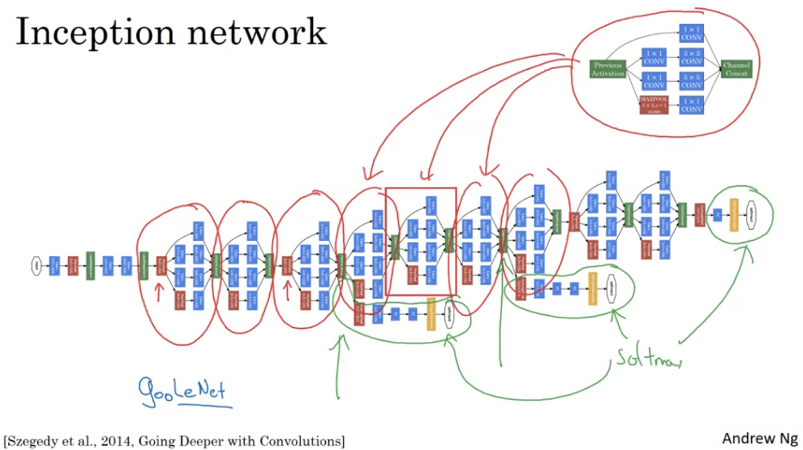

# Course 3: Structering Machine Learning Projects

## Week 2

### Case studies

#### Classic Networks

- Why did Lenet-5 used avg pool? before max pool convention
- Why did it alwasy shrink sizes? no padding on that time
- Lenet didn't used softmax (and used an outdated classifier instead)
- When you deeper the height and width usually goes... ? down
- When you deeper the number of channels goes...? up 
- Conv->pool convention is still quite common
- Back then sigmoid/tanh used instead relu
- Non-linearity used before pooling (today doing it after pooling is more common)

- Much bigger than Lenet (~160M >> ~10k)
- Local Resonse Normalization doesn't seems to be effective and is not in a wide usage today.
- This paper add huge impact

- Keeps size of CONV and POOL constant hence is much less complicated.
- multiple CONV layers back to back before POOL
- where does dimension reduction occur? only on POOL layers
- Why 16? come from the 16 layers
- There is a bigger version VGG-19

#### ResNets

- What is a "shortcut"/skip connection in a Residual block?
- What is the adventage for using residual block as found by the authers? enable to train much deeper networks

- How do you change "Plain network" to Residual Network? adding shortcuts each two layers
- In practice what  happend to the training error of deep plain network? starting to increase after adding more than X layers.

#### Why ResNets Work

- Why/How does dentity function is easy for Residual blocks to learn? 0 weights preserve previous layer values on output
- Why it is common to use "Same" padding? because the shortcut addition is simpler
- How do you add shortcuts without "Same" convolution? Adding new parameters that multiply with shortcut in order to get same size.

#### Networks in Networks and 1x1 Convolutions

- It is easy to think of it as a fully connected network that applied to all the channels

- common usage is to shrink number the of channels

#### Inception Network Motivation

- Why does inception use "Same" padding on the MAX-POOL? to stack output with all others filteres

- What is the main problem with the naive Inception approach as desribed? to many computational cost

- How did the authors solved it? by shrink the inputs with 1x1 CONV.
- What is the acroname for such layer? bottle neck layer

#### Inception Network

- Where did the name come from? the movie

### Practical advices for using ConvNets

#### Using Open Source Implementation

- Why many times it is hard to replicate published papers algorithms? many details are missing such weight decay and other hyper parameters and twiks
- Andrew advice to always check for open source implementation of desired algorithm

#### Trasnfer Learning

- There are many big models that trained few weeks with many resources. We would like to reuse its knowledge (instead of train again, if it even possible)
- How can you use a model trained on imagenet (1000 labels, softmax) for binary classification with small dataset?
  - remove the last layer of model
  - add a sigmoid lauer
  - retrain only last FC parameters
- Many frameworks let you train only last N layers.
- How can you speed up the learning? precompute the last frozen layer output for all inputs (it will not be changed after training too)
- What should you change if you have a bigger dataset?
  - same practive but unfreeze more layers (and update its parameters)
- And if you have hugh amount of data?
  - You can unfreeze all

#### Data Augmentation

- Why do we need data augmentation? not enough data, especially for vision task
- provides several augmentation methods? mirroring, random cropping, (and less common: rotatin, shearing, local warping)

- Why is it good to apply color shifting (color distortation)? make models more robust to the colors of images
- Other than RGB, there is PCA Color augmentaiton that described on Alexnet paper

- distortation and augmentation can be run in parallel to the training, we can do it for each mini-batch before sending it to training and save time.

#### State of Computer Vision

- Explain multi-crop at test time

