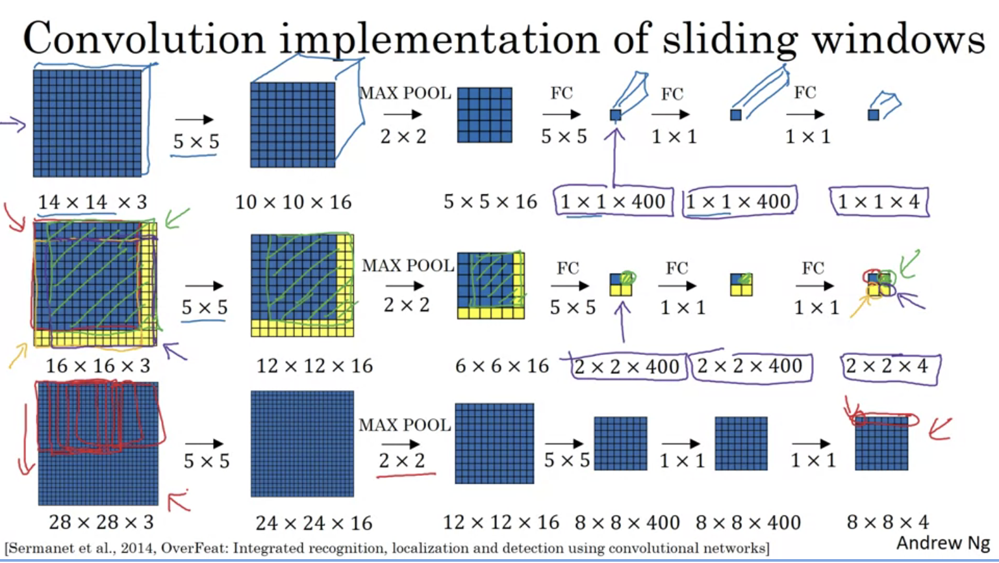
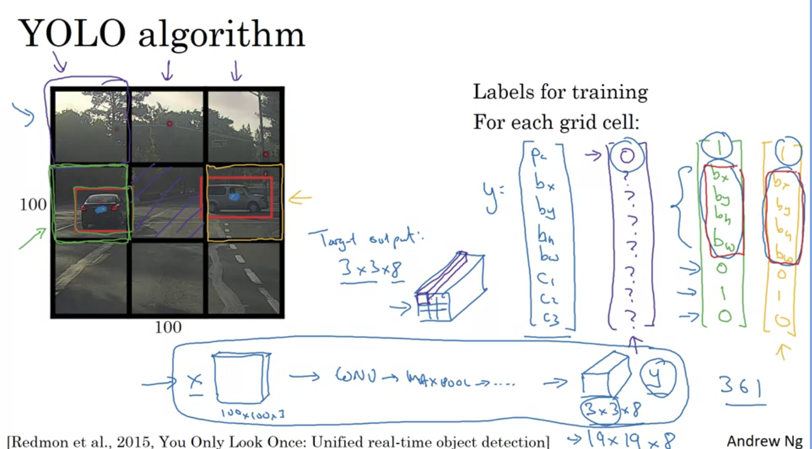

# Course 3: Structering Machine Learning Projects

## Week 2

### Detection Algorithms

#### Object Localization

- What is the output of localization task? is there object, object class, and bounding box

- how do you define loss? what is the loss if there is no object at all?
- probably the classification labels will use log-loss like.

#### Landmark Detection

#### Object Detection

- First train convnet on full size objects

- How can you use the classification model to find objects on an image? sliding windows with different sizes
- What is the disadvantage of using sliding windows? computational cost

#### Convolutional Implementation of Sliding Windows

- How can you solve the sliding window computational cost? convert the FC to conv, and reuse convolutions

- What is the problem with this method? the position of the bounding box is not going to be accurate

- At 7:14, Andrew should have said 2x2x400 instead of 2x2x40.
- At 10:04 onward, the size of the second layer should be 24 x 24 instead of 16 x 16.

#### Bounding Box Predictions

- What is the acronym YOLO? You Only Lool Once
- What is the size of target output of 3x3 grid and 3 classes? 3x3x8
- In practice using something like 19x19 grid
- Can object assign to multiple cells? no, only the one that contains the mid point
- It still uses convolution and not a sliding window

- height and width can goes out of the cell and bigger than 1 and non-negative
- middle point position can't be greater than 1

#### Intersection Over Union